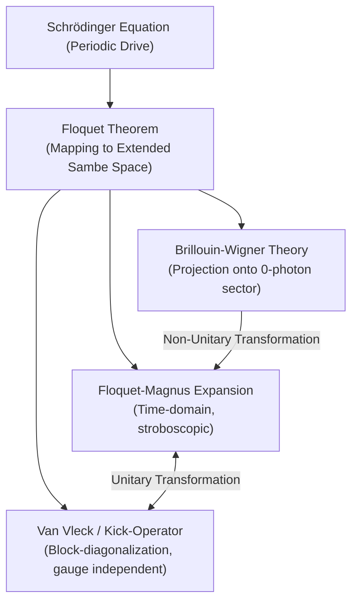

# 💡 Higher Order Frequency Expansion of the Floquet Hamiltonian

You are a PhD or a master's student who has recently joined a quantum tech research lab and has come across "Average Hamiltonian Theory" for periodic time-dependent Hamiltonians, or saw the fancy term "Floquet engineering" for the first time. You get curious and put the query into Google (or nowadays ChatGPT) and see the bloodbath of jargon-heavy physics literature thrown at your screen... the retinas of your eyes are scrolling over the screen and see Floquet-Theory, Floquet-Magnus Expansion, Van Vleck high-frequency expansion all seemingly talking about the same stuff but in their own jargon as if it makes them look cool, lol. If this has not happened to you, congratulations you are smart, but unfortunately I wasn't before I somehow wrapped my head around some papers from a totally unrelated field of condensed matter physics. Here I'm writing this post so if a fellow guy like me comes here seeking some hope, you find it.

Well, all that emotional backstory said, let's get to the point (**I'm not an expert (and neither is anyone else who claims to be one), but I'll do an honest attempt to decipher the average Hamiltonian theory in a way that I understood while learning it myself.**) It might be full of wrong intuition, but who cares as long as it helps you calculate right results, or simply makes a non-journal-type review of the different terms and how they are related. This post has been highly inspired by Marin Bukov's work [1], the definitive comparison by Mikami et al. [2], and the foundational derivations by Eckardt [3] and Sato & Ikeda [4].

Before starting some math and to put things in perspective, the two seemingly different terms: **Average Hamiltonian Theory** (a term popular in the spin resonance / NMR community) is loosely synonymous with the **Van Vleck High-Frequency Expansion** techniques used in condensed matter physics. Also, maybe make it a rule of thumb that any two seemingly different descriptions of something that start from the same point are more or less similarity (or unitary) transformations of each other. It's just a basis change, and so are the above two seemingly unrelated terms. 

In an intuitive sense, these techniques provide us with an *effective Hamiltonian* where the high-frequency oscillations average out, leaving only a description of the slow dynamics. Speaking of starting from the same point, let's actually begin with where they start: the Floquet theorem.

### The Floquet Theorem: The Common Starting Point

All methods begin from Floquet theorem. Floquet theory asserts that if your differential equation looks like the Schrödinger equation and the Hamiltonian is periodic with some period $T$, then every solution can be decomposed into a phase times a function which is also periodic with the same period:

$$ |\psi(t)\rangle = e^{-i\epsilon t}|\phi(t)\rangle \quad \text{where} \quad |\phi(t)\rangle = |\phi(t+T)\rangle $$

The term $\epsilon$ is called the **quasi-energy** and $|\phi(t)\rangle$ is the **Floquet state**.

Ah! A periodic function on both sides? Let's Fourier expand... we expand both sides into their Fourier modes [LINK THE NEXT BLOG ON THE FLOQUET THEOREM DERIVATION HERE]. This decomposes the eigenvalue problem in an extended space termed the **Sambe space** ($\mathcal{H} \otimes \mathcal{T}$), turning our nasty time-dependent differential equation into an infinite, static block-matrix eigenvalue problem:

$$ \sum_n (\hat{H}_{m-n} - m\hbar\omega\,\delta_{m,n})|\phi_n\rangle = \epsilon\,|\phi_m\rangle $$

Where $\hat{H}_n$ are the Fourier components of your time-dependent Hamiltonian. Written out as a giant matrix, the **quasi-energy operator** $\mathcal{K}$ looks like this:

$$
\mathcal{K} = \begin{pmatrix} 
\ddots & \vdots & \vdots & \vdots & \\ 
\dots & \hat{H}_0 - \hbar\omega & \hat{H}_1 & \hat{H}_2 & \dots \\ 
\dots & \hat{H}_{-1} & \hat{H}_0 & \hat{H}_1 & \dots \\ 
\dots & \hat{H}_{-2} & \hat{H}_{-1} & \hat{H}_0 + \hbar\omega & \dots \\ 
 & \vdots & \vdots & \vdots & \ddots 
\end{pmatrix}
$$

The diagonal blocks $\hat{H}_0 + m\hbar\omega$ can be thought of as **photon-number sectors** (representing the atom dressed by $m$ photons from the laser). The off-diagonal terms $\hat{H}_n$ are the interactions that couple sectors differing by $n$ photons.

**The big secret of all these Floquet methods:** This mapping is *exact*. All the different expansion methods below are just different mathematical strategies for trying to block-diagonalize this exact, infinite matrix!

### 1. The Spin Resonance Side: Average Hamiltonian Theory & Floquet-Magnus

Let's first start with the spin resonance side of the community. Average Hamiltonian Theory (AHT) is usually studied in the context of describing the time dynamics of a spin system driven by periodic Radio/Microwave pulses (like in NMR). If we stick to the rule that we only observe the system **stroboscopically** (a fancy term to say that we observe the system at exact integer multiples of the period only), then one asks an obvious question: *Can I find a time-independent Hamiltonian that gives equivalent time evolution as the time-dependent Hamiltonian?* 

The answer is yes. But the stroboscopic nature of the mathematics introduces something called a **"Floquet gauge" dependence** in the effective Hamiltonian. This is another fancy term to say that the effective Hamiltonian depends heavily on the *initial phase* (or start time $t_0$) of your pulse.

This approach uses the **Floquet-Magnus Expansion (FME)**. Up to first order in the inverse frequency ($1/\omega$), the effective Hamiltonian looks like:

$$ F_{\text{FM}}^{(1)} = \sum_{m\neq 0} \frac{[H_{-m}, H_m]}{2m\omega} + \sum_{m\neq 0}\frac{[H_m, H_0]}{m\omega}e^{-im\omega t_0} $$

See those $e^{-im\omega t_0}$ terms? That's the gauge dependence. It means your effective Hamiltonian changes depending on when exactly you turned on your stopwatch.

### 2. The Condensed Matter Side: Van Vleck & Kick Operators

The condensed matter theorists want to study the action of the effective Hamiltonian at *arbitrary* times, not necessarily stroboscopic like the chemists. (Chemists are lazy but practical; physicists are wannabe hardworking so they try to work out all these calculations that they could have avoided like chemists, but we need to look cool at parties :)). 

Hence, they do a **non-stroboscopic** analysis. Instead of baking the initial time $t_0$ into the Hamiltonian, they separate the evolution into a slow, gauge-independent effective Hamiltonian, sandwiched between fast, periodic **"kick operators"** $e^{-iK(t)}$ that handle the rapid micromotion jiggling [1].

This leads to the **Van Vleck High-Frequency Expansion**. The beauty of this method is that the effective Hamiltonian is perfectly independent of $t_0$. Up to first order, it simply drops the annoying $t_0$-dependent terms from the Magnus expansion:

$$ F_{\text{vV}}^{(1)} = \sum_{m\neq 0}\frac{[H_{-m}, H_m]}{2m\omega} $$

This is the famous equation you'll see in papers by Eckardt [3] and Sato & Ikeda [4]. It is mathematically derived by performing a unitary block-diagonalization (a Schrieffer-Wolff transformation) in the extended Floquet space.

### 3. The Third Player: Brillouin-Wigner (BW) Theory

Just when you thought two methods were enough, the **Brillouin-Wigner (BW) Expansion** enters the chat [2]. While Van Vleck achieves its results by *rotating* the infinite matrix to make it block-diagonal, BW does it by brute-force *projecting* the matrix down to the zero-photon sector.

The catch? Because projection is not a unitary operation, the BW effective Hamiltonian is generally **non-Hermitian** if you truncate the series, and it features energy-dependent denominators. However, physicists sometimes prefer it for calculating higher-order corrections because the algebra is recursively much simpler than computing endless nested commutators in Magnus or Van Vleck.

### The Ultimate Cheat Sheet: Feature Comparison

If you need a quick reference for why you might pick one method over another, here is how their features stack up:

| Feature | Floquet-Magnus (FME) | Van Vleck / Kick-Operator | Brillouin-Wigner (BW) |
| :--- | :--- | :--- | :--- |
| **Gives effective Hamiltonian?** | Yes | Yes | Yes |
| **Gives micromotion (the jiggling)?**| Yes (via $\Theta_{\text{FM}}$) | Yes (via kick operator) | Yes (via wave operator) |
| **Gauge (start-time) independent?** | ❌ No (depends on $t_0$) | ✅ Yes | ✅ Yes |
| **Guaranteed Hermitian?** | ✅ Yes | ✅ Yes | ❌ No (if truncated early) |
| **Mathematical technique** | Time-domain periodicity | Floquet space rotation (block-diag) | Floquet space projection |

### At What Order Do They Actually Diverge?

Since they are all doing the exact same physical job, they agree at the lowest order. But as you ask for more precision (higher orders of $1/\omega$), their different math philosophies cause their formulas to explicitly diverge:

| Order in $(1/\omega)$ | Floquet-Magnus vs. Van Vleck | Van Vleck vs. Brillouin-Wigner |
| :--- | :--- | :--- |
| **0th Order** | ✅ **Agree:** Both simply give the time-averaged Hamiltonian $H_0$. | ✅ **Agree** |
| **1st Order** | ⚠️ **Differ:** Floquet-Magnus picks up $t_0$-dependent terms; Van Vleck remains clean. | ✅ **Agree:** They share the exact same $t_0$-independent formula. |
| **2nd Order** | ⚠️ **Differ:** Even more $t_0$-dependent terms appear in FME. | ⚠️ **Differ:** BW diverges structurally, creating energy-dependent denominators and dropping Hermiticity. |

### Summary: The "Family Tree" of Floquet Methods

If you ever get lost in the literature, here is the cheat sheet map of how all these methods are related [2]:

Here is the human-friendly way to read this map:

1. **The Starting Point:** We start at the very top with the nasty time-dependent Schrödinger equation. The Floquet Theorem saves us by mapping this problem into a massive, infinite static matrix (the Sambe space). Now we just have to solve a matrix!
2. **The Two "Rotations" (FME & Van Vleck):** Both the Floquet-Magnus and Van Vleck expansions try to solve this by carefully *rotating* the matrix until it's easy to read. Because they are just applying unitary rotations, they guarantee that your final effective Hamiltonian is perfectly Hermitian. 
    * The only difference? Floquet-Magnus bakes the start time $t_0$ into the rotation. Van Vleck explicitly avoids this, keeping the effective Hamiltonian totally gauge-independent. 
    * Because they are just two different rotations of the exact same matrix, you can jump back and forth between them using a simple unitary transformation!
3. **The "Projection" (Brillouin-Wigner):** Brillouin-Wigner goes rogue. Instead of rotating the matrix, it uses brute-force to *project* the infinite matrix down to just the slow-dynamics sector. Because projection is a non-unitary operation, the resulting effective Hamiltonian isn't guaranteed to be Hermitian if you truncate the math early. You can mathematically transform a BW result into an FME result, but you have to use a messy non-unitary "wave operator" to do it.

At the end of the day, if you don't truncate the infinite series, they all yield the exact same quasi-energy spectrum. It's just a matter of picking the right mathematical tool for your specific experimental reality!

### References
[1] Bukov, M., D'Alessio, L., & Polkovnikov, A. (2015). *Universal high-frequency behavior of periodically driven systems*. Advances in Physics.
[2] Mikami, T., Kitamura, S., et al. (2016). *Brillouin-Wigner perturbation theory for Floquet systems*. Physical Review B.
[3] Eckardt, A., & Anisimovas, E. (2015). *High-frequency approximation for periodically driven systems*. New Journal of Physics.
[4] Sato, M., & Ikeda, T. N. (2025). *Floquet Theory and Applications in Open Quantum and Classical Systems*.

# Future work
Make a blog describing the Floquet theory derivation.